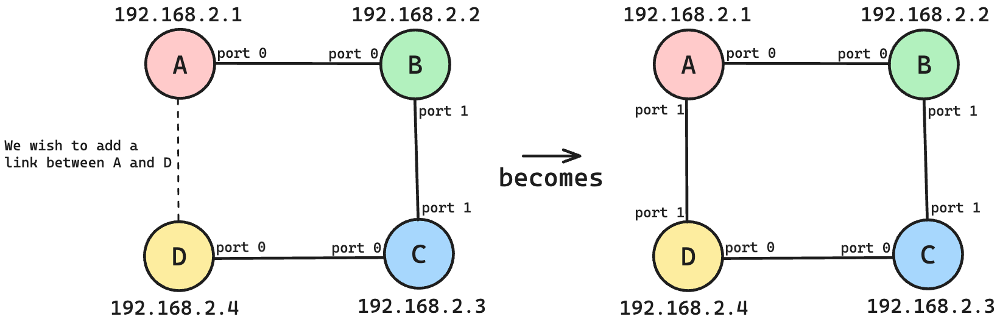
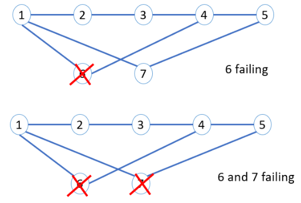

# Link State Routing - A Java Simulation

### Authors
- Denis Aleksandrov
- Sebastian Castro Obando

### Decription
This project is a simulation of a link state routing protocol. The project is written in Java and uses Java socket programming to simulate the communication between routers. The routers are connected in a network and exchange link state advertisements (LSAs) through LSA updates and flooding. The routers use the Dijkstra algorithm on their link state database to calculate the shortest path to all other routers in the network.

### How to compile and run
To compile the project, run the following command in the project root directory:
```bash
./compile.sh
```
To run a router, run the following command in the project root directory:
```bash
./run.sh router1
```
Note that there are 7 router configurations in the `conf` directory. You can run any of them by replacing `router1` with the desired router configuration file name.

### Example Topologies

#### Topology 1 - Showing cyclic handling behavior
In this topology, we want to show how the routers handle cyclic paths. [Watch video presentation here.]()



#### Topology 2 - Simulating link failure
In this topology, we want to show how the routers handle link failure. [Watch video presentation here.]()



#### Topology 3 - Big network
In this topology, we want to show how the routers handle communications within a big network. [Watch video presentation here.]()


### Contributions disclosure
Each author contributed equally to the project.

---
### Non-important TODOs 
-[ ] you can attach twice to the same router. Should we check for this? 
-[ ] should the synchronization happen over all the LSA update? Because LSA can change between update and moment we get the vector. 